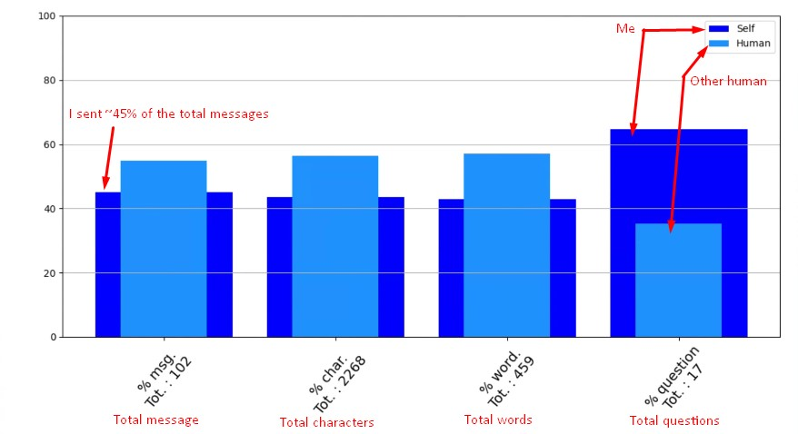

# TndR

TndR is a python library to see/show uninteresting data of your Tinder conversation.

## The idea

One of my match told me, after I stoped talking, "Well, you're ghosting me". Well, technically yes, but why? Maybe because I'm the only one to carrying this damn conversation.

So, instead of just ghosting that human, I just thought *it could be cool* to actually explain why I was ghosting that kind human.

## Informations

Matplotlib is the only required library **FOR THE DEMO**.

Please, have a look at the [documentation](https://mcxiv-python.000webhostapp.com/).

## Extract Tinder conversation

As I am not an expert (*yet!*) in web scrapping, I didn't know how to - **automatically** - get the full conversation. (Prob. using Selenium, but you know, **"time"**)

### To do :

- Connect to [tinder.com](https://www.tinder.com/)
- Select the conversation you want
- Right click on the first message, and click *Inspect*
- Go up a little bit and find the element **<div id="SC.chat_xxxx**
- Right click on it and **Copy -> Copy element**
- Past it, raw, into a .txt file

See **'TndR_1.png'**  and **'TndR_2.png'** for visual explanation


## Quick Usage
```python
from TndR import *

demo.show()

# Will show a graph. with stats. of your own .txt file. See TndR_ex.png for an example.
```


## Contributing

Do whatever you want

## License
[MIT](https://choosealicense.com/licenses/mit/)
